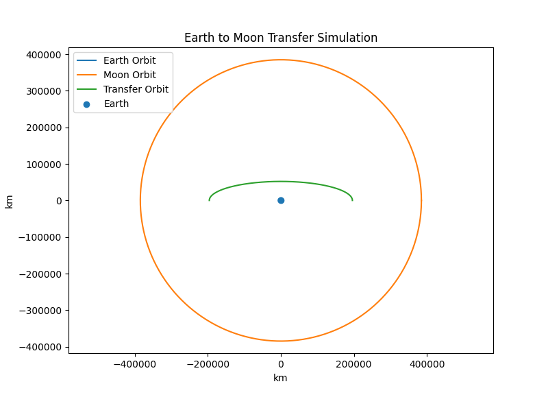

# Earth to Moon Mission Simulation 🌙🚀

Hi, I’m Anannya.

This project is a simple simulation of a spacecraft traveling from Earth orbit to the Moon using a **Hohmann Transfer Orbit**.

I built this to understand how real space missions are designed — starting from basic physics and turning it into a visual trajectory.

---

## Objective

To simulate a transfer orbit between Earth and Moon and calculate the velocity change required for the mission.

---

## Method

- Initial orbit radius: 7000 km  
- Moon orbit radius: 384,400 km  
- Transfer type: Hohmann transfer (elliptical trajectory)  

---

## Results

- Required Δv: ~3.1 km/s  
- Transfer orbit: elliptical path connecting Earth orbit and Moon orbit  

---

## Visualization

---

## What I Learned

- How spacecraft move between orbits  
- How transfer trajectories are designed  
- How fuel requirements are calculated  

---

## Why This Project Matters

This is a small step toward my goal of working in:

- Space mission simulation  
- Astrodynamics  
- Spacecraft trajectory design  

---

*Every space mission starts with a simulation like this. This is mine.* 🚀
